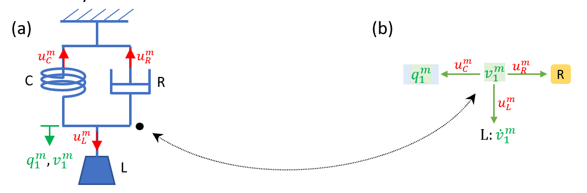
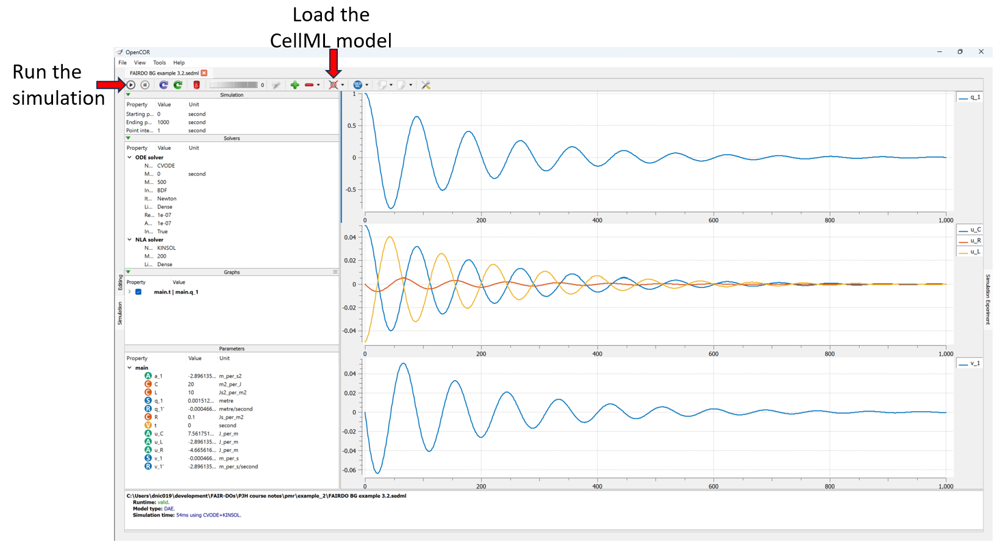

Bond graph example: A mechanical system
=======================================

Here we show a simple mechanical system with a spring for static energy storage (compliance C), a mass (L) for dynamic (inertial) energy storage, and a damper (R) for dissipating energy.
The potentials :math:`u_C^m`, :math:`u_R^m`, :math:`u_L^m` (superscript ‘m’ for ‘mechanical’) are now the mechanical forces and the flow :math:`v_1^m` is the velocity of the displacement :math:`q_1^m`. i.e., :math:`v_1^m=(dq_1^m)/dt`. There is one common point where energy is balanced (the 1:node) and in this system there is no need for a 0:node for mass conservation.

   A simple mechanical system (a) with spring C, damper R and mass L, and its bond graph representation (b). In this case the 1:node represents the physical point (indicated by the dotted line) at which energy is balanced (forces in equilibrium). Since there is only one displacement and hence flow (velocity) term, no 0:nodes are required.

The **Views Available** menu to the right provides various options to explore this model here in the Physiome Model Repository.
Of particular interest is the *Launch with OpenCOR* menu item, which will load the simulation experiment shown below directly into the `OpenCOR`_ desktop application.

   Showing the result of launching the simulation experiment from this exposure in OpenCOR and executing the simulation.

.. _CellML: https://www.cellml.org/
.. _OpenCOR: https://opencor.ws/
.. _SED-ML: https://sed-ml.org